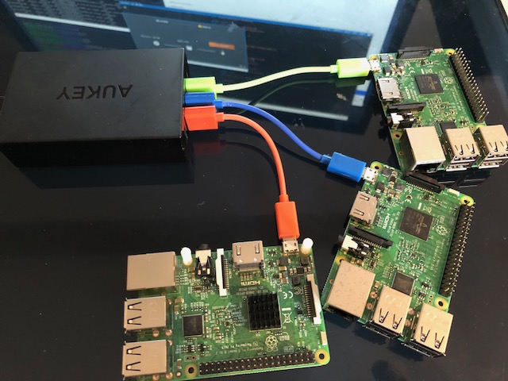

# Kubernetes Ansible playbook for Raspbian Stretch on Raspberry Pis

Ansible playbook for Raspberry Pis. Inspiration from many sources, not least of which https://gist.github.com/alexellis/fdbc90de7691a1b9edb545c17da2d975



## Pre-requisites

* Ansible v2.3 on the controller (I used Ubuntu 16.04 on Windows - WSL). This is not available in the 16.04 apt repos so must be installed separately
* Raspbian Stretch Lite installed on all Raspberry Pis (Note: you need an ARMv7 architecture - so Raspberry Pi Zeros are not supported). Tested with release 2017-11-29, sha e942b70072f2e83c446b9de6f202eb8f9692c06e7d92c343361340cc016e0c9f.
* ssh needs to be available on Raspbian (create a blank ssh file in the root directory of the SD card).
* The Raspberry Pis need a network connection. If you are using WiFi, make sure your /etc/wpa_supplicant/wpa_supplicant.conf file is correct. The Raspbian Stretch syntax is [different](https://howchoo.com/g/ndy1zte2yjn/how-to-set-up-wifi-on-your-raspberry-pi-without-ethernet) to the Jessie syntax commonly shared. 

Prepare by copying your public SSH key to each server/node to allow ansible to connect:

```bash
$ ssh-keygen
$ ssh-copy-id pi@node-ip-address
```

## Usage

Add all your hosts to the host inventory file. You should have a single master and multiple worker nodes. Then run the ansible playbook: 

```bash 
$ ansible-playbook cluster.yml -i hosts
```

The playbook will print 2 variables
* the worker-node join token with a 24 hour lifetime
* the port number of the dashboard exposed on each node

[](https://asciinema.org/a/2idgjSVX9A2UUpLROCdYlQUKC?speed=4)

## Roadmap

- [x] Access to the dashboard remotely
- [x] Refactor into ansible roles
- [ ] Provision worker nodes
- [ ] Add a service mesh
- [ ] Install the dashboard using kubectl from the ansible controller, not the ansible target
- [ ] Yaml files stored in ansible playbook, not on the Internet
- [ ] Run helm/tiller